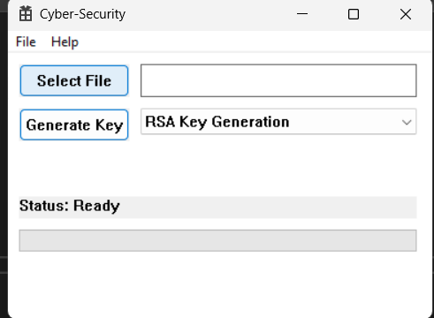
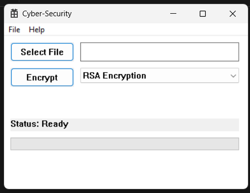
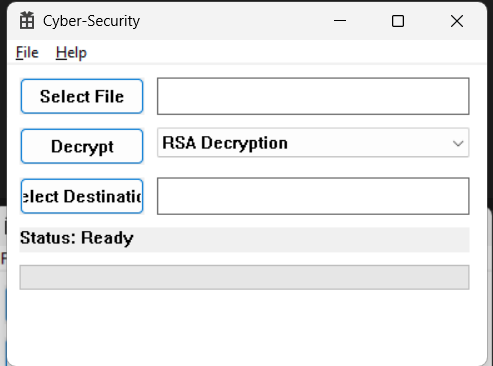
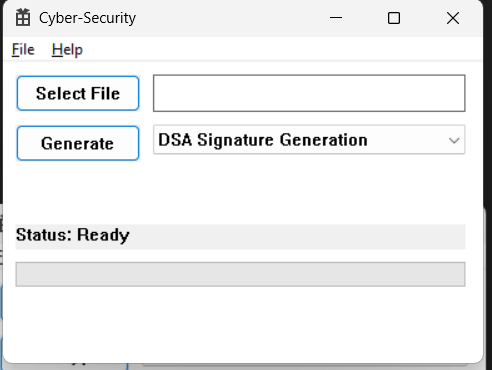
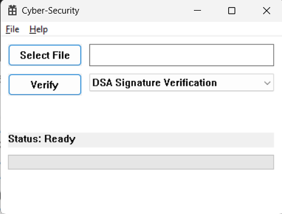
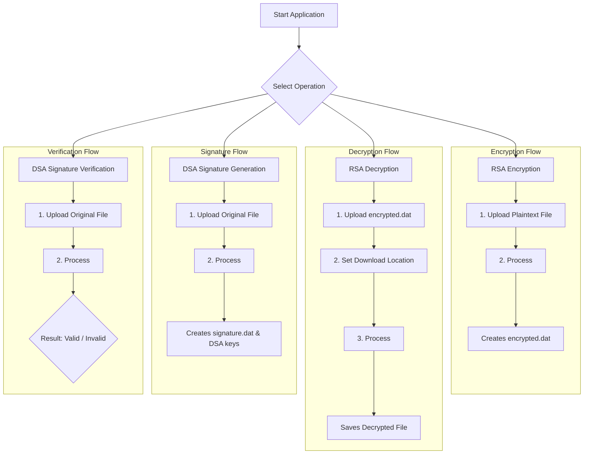

# Cyber Security Cryptography Tool

A user-friendly Windows desktop application for performing essential cryptographic operations. This tool provides a graphical user interface (GUI) for encrypting and decrypting files using **RSA** and generating and verifying digital signatures using **DSA**. It's designed as a practical demonstration of the **Crypto++** library in a C++ Win32 environment.

---

## Screenshots

1) **RSA Key Generation**  



2) **RSA Encryption**  



3) **RSA Decryption**  



4) **DSA Signature Generation**  



5) **DSA Signature Verification**  



---

## Features

### 🔐 RSA Asymmetric Encryption

* **Generate RSA Keys:** Creates a 2048-bit RSA public/private key pair.
* **Encrypt Files:** Encrypts any file using the generated public key.
* **Decrypt Files:** Decrypts files using the corresponding private key.

### ✍️ DSA Digital Signatures

* **Generate DSA Keys & Signature:** Creates a 1024-bit DSA key pair and generates a digital signature for a chosen file.
* **Verify Signature:** Checks the integrity and authenticity of a file by verifying its digital signature.

### 💻 User-Friendly Interface

* **Responsive UI:** Cryptographic operations run on a background thread to prevent UI freezing.
* **Progress Bar:** Provides visual feedback during file processing.
* **Clear Error Handling:** Displays detailed error messages in pop-up dialogs.

---

## Application Workflow Canvas

This diagram illustrates the primary workflows within the application.



---

## Getting Started

### 🔧 Prerequisites

* **Visual Studio 2022:** Install with the *Desktop development with C++* workload.
* **Crypto++ Library:** Required for cryptographic functions.

  * **Download:** [Crypto++ Official Website](https://www.cryptopp.com/)
  * **Integration:** Configure Visual Studio project to link against the Crypto++ library.

    * Set *Include Directories* and *Library Directories* to point to your Crypto++ installation.

---

### 🚀 How to Build and Run

1. **Clone the Repository:**

   ```bash
   git clone https://github.com/Krishna200608/Cyber-Security-Project.git
   ```
2. **Configure Crypto++:** Ensure Visual Studio can find your Crypto++ library files.
3. **Open in Visual Studio:** Open the `Cyber-Security.sln` solution file.
4. **Set Build Configuration:** Choose Debug or Release for the *x64* platform.
5. **Build the Solution:** From the top menu, select `Build > Build Solution`.
6. **Run the Application:** Press `F5` or run the generated `.exe` from the build output folder (`x64/Debug` or `x64/Release`).
