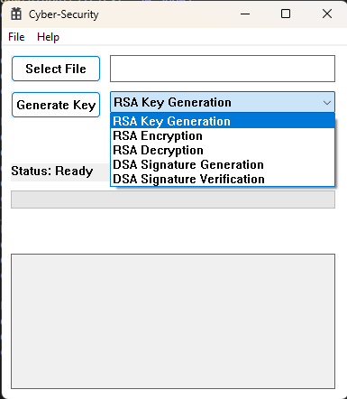
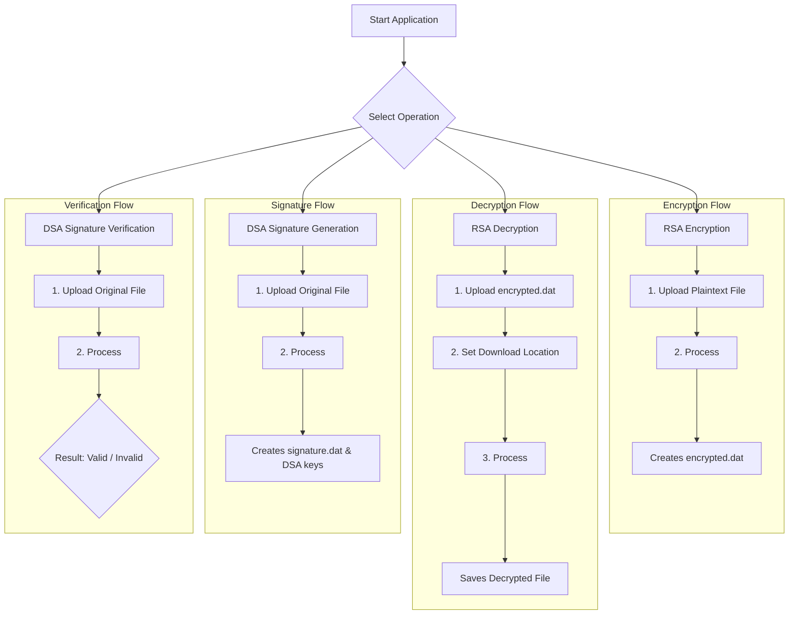
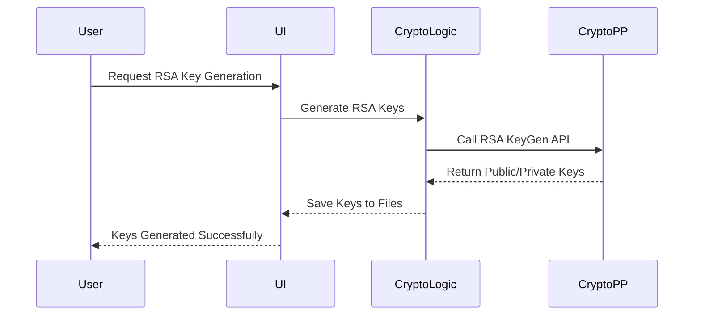
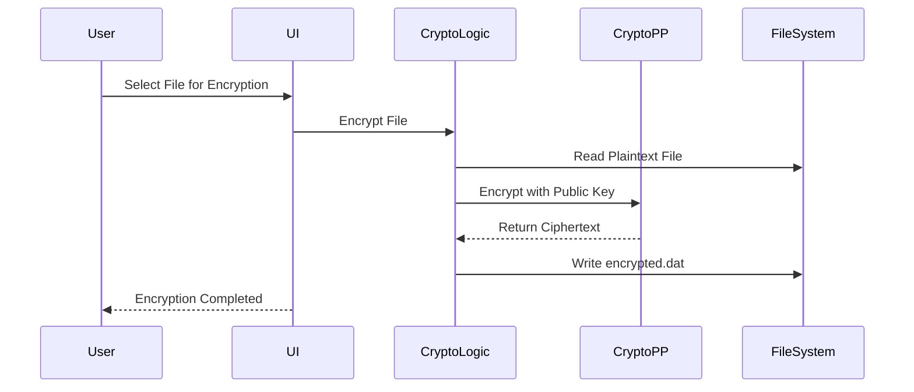
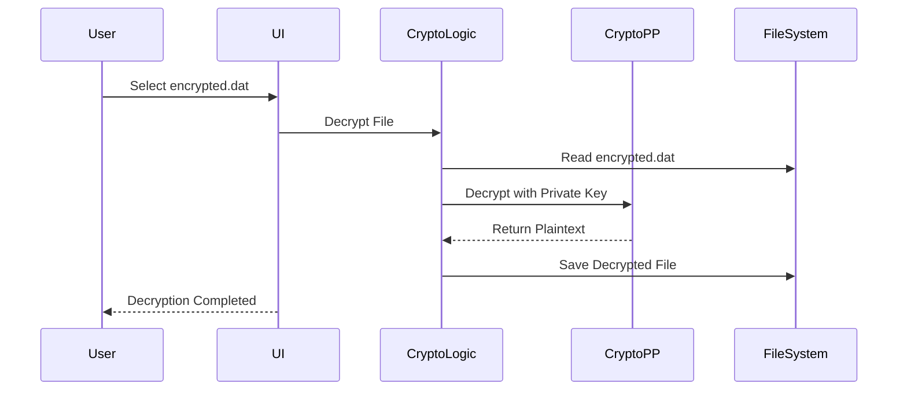
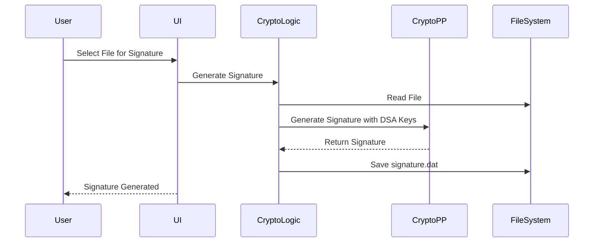
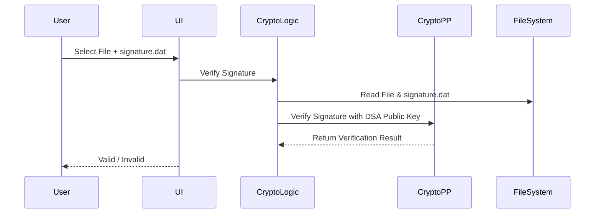

# Cyber Security Cryptography Tool

A user-friendly Windows desktop application for performing essential cryptographic operations. This tool provides a graphical user interface (GUI) for encrypting and decrypting files using **RSA** and generating and verifying digital signatures using **DSA**. It's designed as a practical demonstration of the **Crypto++** library in a C++ Win32 environment.

---

## Output

1. **Application UI**


---

## Features

### 🔐 RSA Asymmetric Encryption

* **Generate RSA Keys:** Creates a 2048-bit RSA public/private key pair.
* **Encrypt Files:** Encrypts any file using the generated public key.
* **Decrypt Files:** Decrypts files using the corresponding private key.

### ✍️ DSA Digital Signatures

* **Generate DSA Keys & Signature:** Creates a 1024-bit DSA key pair and generates a digital signature for a chosen file.
* **Verify Signature:** Checks the integrity and authenticity of a file by verifying its digital signature.

### 💻 User-Friendly Interface

* **Responsive UI:** Cryptographic operations run on a background thread to prevent UI freezing.
* **Progress Bar:** Provides visual feedback during file processing.
* **Clear Error Handling:** Displays detailed error messages in pop-up dialogs.

---

## 📂 File Structure

```
Cyber-Security-Project/
|-- .gitattributes
|-- .gitignore
|-- Cyber-Security.sln
|-- Cyber-Security/
|   |-- Cyber-Security.cpp
|   |-- Cyber-Security.h
|   |-- Cyber-Security.ico
|   |-- Cyber-Security.rc
|   |-- Cyber-Security.vcxproj
|   |-- framework.h
|   |-- Resource.h
|   `-- ... (other project files)
|-- Images/
|   |-- key_gen.png
|   |-- rsa_en.png
|   |-- rsa_de.png
|   |-- dsa_sig_gen.png
|   `-- dsa_sig_verify.png
|-- README.md
`-- test/
    |-- Message.txt
    `-- ... (test files)
```

---

## Component Diagram

```mermaid
flowchart TD
    UI[UI (Win32 API)] -- "Invokes Operations" --> CryptoLogic[Crypto Logic]
    CryptoLogic -- "Uses" --> CryptoPP[Crypto++ Library]
    CryptoLogic -- "Reads/Writes Files" --> FileSystem[File System]

```

---

## Application Workflow Canvas



---

## Sequence Diagrams

### 🔑 RSA Key Pair Generation



### 🔐 RSA Encryption



### 🔓 RSA Decryption



### 🖊️ DSA Signature Generation



### ✅ DSA Signature Verification



---

## Getting Started

### 🔧 Prerequisites

* **Visual Studio 2022:** Install with the *Desktop development with C++* workload.
* **Crypto++ Library:** Required for cryptographic functions.

  * **Download:** [Crypto++ Official Website](https://www.cryptopp.com)
  * **Integration:** Configure Visual Studio project to link against the Crypto++ library.
  * Set *Include Directories* and *Library Directories* to point to your Crypto++ installation.

### 🚀 How to Build and Run

1. **Clone the Repository**

```bash
git clone https://github.com/Krishna200608/Cyber-Security-Project.git
```

2. **Open in Visual Studio**
   Open the `Cyber-Security.sln` solution file.

3. **Configure Crypto++**

   * Right-click on the **Cyber-Security** project → Properties.
   * Set **Configuration**: `Debug`, **Platform**: `x64`.
   * Go to *Configuration Properties → VC++ Directories*:

     * **Include Directories:** `C:\Users\YourUser\Downloads\cryptopp890`
     * **Library Directories:** `C:\Users\YourUser\Downloads\cryptopp890\x64\Output\Debug`
   * Go to *Configuration Properties → Linker → Input*:

     * Add `cryptlib.lib` to **Additional Dependencies**.
   * Click **Apply** → **OK**.

4. **Set Build Configuration**
   Choose **Debug** or **Release** for the `x64` platform.

5. **Build the Solution**
   From the top menu: `Build → Build Solution`.

6. **Run the Application**
   Press `F5` or run the generated `.exe` from the build output folder (`x64/Debug` or `x64/Release`).
